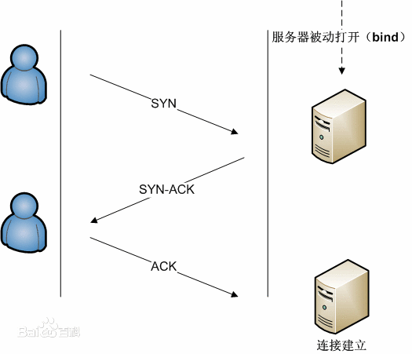
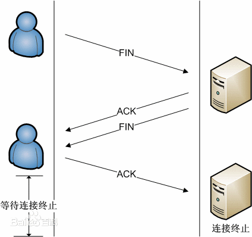

# TCP 协议

传输控制协议（TCP，Transmission Control Protocol）是一种面向连接的、可靠的、基于字节流的传输层通信协议。

## 三次握手

TCP 连接需要进过一个三次握手的过程，这是为了避免客服端传递错误信息并且直接与服务端建立联系。

① 客户端向服务器发送一个 SYN 报文，告诉服务器 我要和你建立连接啦

② 服务器接收到 SYN 码后，向客户端发送 SYN 报文和 ACK 报文 ，表示同意建立连接

③ 客户端向服务器发送 ACK 报文，进入准备连接状态

## 四次挥手

TCP 断开连接需要进过一个四次挥手的过程，原因是 TCP 半关闭状态导致的；
① 客户端向服务端发送 FIN 报文，要求断开连接

② 服务器收到 FIN 报文，向客户端发送 ACK 确认码,进入 close-wait 状态。这时候客户端已经没有数据向服务器发送，TCP 进入半关闭状态。但是服务器可以向客户端继续发送信息

③ 服务器信息传送结束后，向客户端发送 FIN 报文，告诉客户端我也没有信息向你发送啦

④ 客户端向服务端发送 ACK 确认码，客户端就进入了 time-wait 状态

## TCP 协议 与 UDP 协议的区别

TCP 协议 与 UDP 协议都是传输层协议，但是 TCP 是稳定的 面向连接的协议，TCP 内部做了以下的规定

① 数据分片：在发送端对用户数据进行分片，在接收端进行重组，由 TCP 确定分片的大小并控制分片和重组；

② 到达确认：接收端接收到分片数据时，根据分片数据序号向发送端发送一个确认；

③ 超时重发：发送方在发送分片时启动超时定时器，如果在定时器超时之后没有收到相应的确认，重发分片；

④ 滑动窗口：TCP 连接每一方的接收缓冲空间大小都固定，接收端只允许另一端发送接收端缓冲区所能接纳的数据，TCP 在滑动窗口的基础上提供流量控制，防止较快主机致使较慢主机的缓冲区溢出；

⑤ 失序处理：作为 IP 数据报来传输的 TCP 分片到达时可能会失序，TCP 将对收到的数据进行重新排序，将收到的数据以正确的顺序交给应用层；

⑥ 重复处理：作为 IP 数据报来传输的 TCP 分片会发生重复，TCP 的接收端必须丢弃重复的数据；

⑦ 数据校验：TCP 将保持它首部和数据的检验和，这是一个端到端的检验和，目的是检测数据在传输过程中的任何变化。如果收到分片的检验和有差错，TCP 将丢弃这个分片，并不确认收到此报文段导致对端超时并重发。

UDP 在传输数据前不建立连接，不对数据报进行检查与修改，无须等待对方的应答，所以会出现分组丢失、重复、乱序，应用程序需要负责传输可靠性方面的所有工作；UDP 具有较好的实时性，工作效率较 TCP 协议高；UDP 段结构比 TCP 的段结构简单，因此网络开销也小
